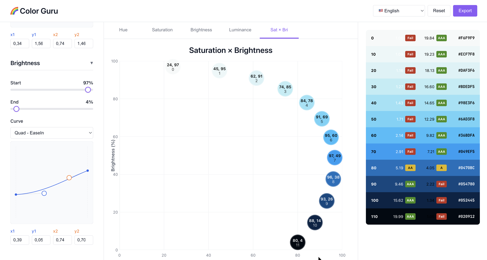

# 🌈️ Color Guru

A powerful web application for generating accessible, visually consistent color palettes and gradients for UI design.



## Features

- **Interactive controls**: Adjust steps, hue, saturation, and luminosity with real-time updates
- **Curve editor**: Editor with draggable handles and numeric inputs. Presets map to well-known easing curves and can be fine‑tuned live
- **Dynamic graph visualization**: Toggle between hue, saturation, and luminosity graphs
- **Accessibility**: WCAG compliance indicators and contrast ratio calculations
- **Export options**: CSS variables, JSON, plain text, and Figma-ready SVG formats
- **Copy to clipboard**: One-click copying of individual hex values
- **Multilanguage UI**: Language switcher with instant translations

## Getting Started

### Prerequisites

- Node.js (version 18 or higher)
- npm or yarn

### Installation

1. Clone the repository or navigate to the project directory
2. Install dependencies:

   ```bash
   npm install
   ```

3. Start the development server:

   ```bash
   npm run dev
   ```

4. Open your browser and navigate to `http://localhost:5173`

### Building for Production

```bash
npm run build
```

The built files will be available in the `dist` directory.

## Usage

1. **Steps control**: Use the slider to set how many colors (3-21) you want in your palette
2. **Hue settings**: Set start/end hue (0–360°), choose a curve preset, then tweak the cubic‑bezier handles or inputs. Optionally toggle long‑path hue interpolation
3. **Saturation settings**: Set start/end %, choose/tune curve preset, and adjust the rate multiplier
4. **Brightness settings**: Set start/end %, choose/tune curve preset
5. **Curve editor**: Drag the two handles or type `x1`, `y1`, `x2`, `y2` values. Y can go below 0 or above 1 (for Back‑style overshoot). Changes update the palette in real time
6. **Graph view**: Switch between Hue, Saturation, Brightness, Luminance, or Sat×Bri visualizations
7. **Palette preview**: View generated colors with contrast ratios and WCAG levels
8. **Export**: Click the "Export" button to save your palette in various formats:
   - **CSS**: CSS custom properties (variables)
   - **JSON**: Complete palette data with settings and accessibility info
   - **Plain Text**: Simple list of hex codes
   - **Figma**: SVG code ready to paste directly into Figma
9. **Figma workflow**: Select the "Figma" tab in the Export dialog, copy the SVG code, then paste (Cmd/Ctrl+V) directly on your Figma canvas. The palette will appear as a row of rectangles, so you can quickly apply the colors to your components before committing to a final style sheet or color variables.

## Color Math

The application uses advanced color interpolation with:

- HSL to RGB conversion for accurate color representation
- Multiple easing curves for smooth transitions, driven by cubic‑bezier evaluation (with presets from easings.net)
- Contrast ratio calculations following WCAG 2.0 standards
- Intelligent hue interpolation around the color wheel

Curve preset parameters are sourced from easings.net (Linear, Sine, Quad, Cubic, Quart, Quint, Expo, Circ, Back). Elastic and Bounce are intentionally excluded because they cannot be represented by four control points.

Reference: https://raw.githubusercontent.com/ai/easings.net/refs/heads/master/src/easings.yml

## Accessibility

Each generated color includes:

- Contrast ratios against white and black backgrounds
- WCAG 2.0 compliance levels (AAA, AA, A, or Fail)
- Visual indicators for accessibility standards

## Technology stack

- **React 18** with TypeScript
- **Vite** for fast development and building
- **CSS3** with custom properties
- **SVG** for graph visualizations
- **Modern JavaScript** (ES2020+)

## References

This project was built with a lot of help from Claude Code, and was heavily inspired by [Kevyn Arnott](https://x.com/kvyn_)'s first version of [Colorbox](https://colorbox.io/). Also, the following articles have inspired the tools that were incorporated:

- [Designing Systematic Colors](https://uxplanet.org/designing-systematic-colors-b5d2605b15c)
- [Color in UI Design: A (Practical) Framework](https://www.learnui.design/blog/color-in-ui-design-a-practical-framework.html)
- [How to pick more beautiful colors for your data visualizations](https://www.datawrapper.de/blog/beautifulcolors)
- [Colorimetry and the Cartography of Color](https://medium.com/thinking-design/colorimetry-and-the-cartography-of-color-415ef5315c0a)

## License

This project is open source and available under the MIT License.
